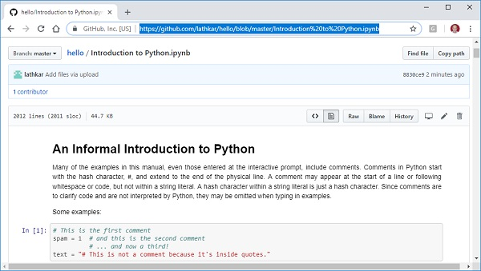
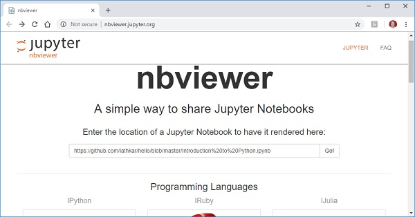

# Projects
This repo hosts a collection of all the projects i have worked on.

### Quick Note
Majority of these projects will be presented as a Jupiter Note book

- Clicking on the .ipynb file will show a static preview of the note book

### View the full interactive note book

1. Copy the url/link to the jupiter note book.

2. Navigate nbviewer >>>  https://nbviewer.jupyter.org/
    - Paste the link on the jupiter note book and click "go" to have it rendered.
  

